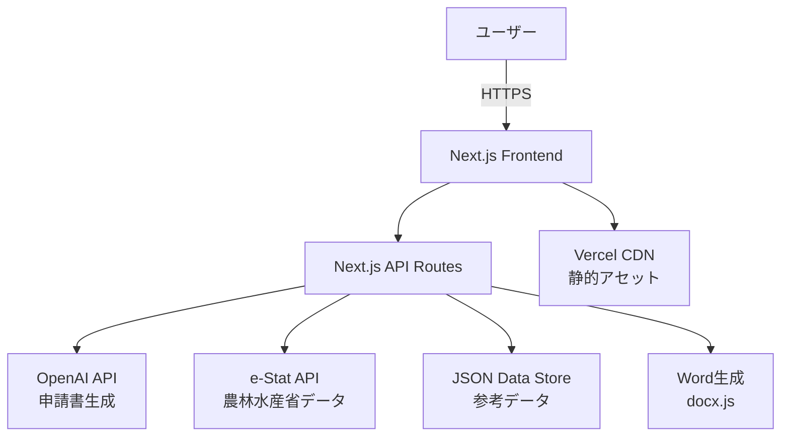

# 要件定義書（更新版）

## 1. プロジェクト概要

### 1.1 プロジェクト名

- **「新規就農者向けAI申請書生成プラットフォーム」**

### 1.2 背景・目的

- **背景**: 
  - 既存農家は収支予測が困難で、記録管理ツールはあっても「記録止まり」で意思決定につながらない
  - 新規就農者は計画作成・申請準備が煩雑で時間がかかり、就農への障壁となっている
  - 農業DXの推進により、データドリブンな農業経営への転換が求められている
  - 地域・同規模でのベンチマーク情報が不足し、改善余地が見えにくい
  - 農業申請書類の作成が複雑で、新規就農の大きな障壁となっている

- **目的**: 
  - 既存農家：収支管理・データ蓄積によるAI経営アドバイス、収益最適化支援
  - 新規就農者：3項目入力での瞬間予算感表示、農業経営改善計画認定申請書の自動生成
  - データネットワーク効果：既存農家のデータを活用した新規就農者向け高精度予測
  - 社会全体：農業生産性向上、新規就農者増加、地域農業の持続可能性向上

### 1.3 システムのビジョン / スコープ

- **ビジョン**: 
  - 農業における「最小入力で最大価値」を実現し、データネットワーク効果により使用者が増えるほど予測精度が向上するプラットフォーム
  - 従来の「記録管理」から「予測・意思決定支援」への転換を実現
  - 既存農家と新規就農者の相互強化により、農業界全体のDXを推進

- **スコープ**: 
  - **含まれる範囲**: Webアプリケーションとしての1週間MVP実装、3項目入力での瞬間予算感表示、AI申請書自動生成
  - **MVP Phase**: 新規就農者向け申請書生成機能、外部データ（e-Stat）活用の推定ロジック
  - **Phase 2**: 既存農家向け収支管理・データ蓄積機能、AI経営アドバイス
  - **含まれない範囲**: ネイティブモバイルアプリ、IoTハードウェア連携、海外展開
  - **将来拡張予定**: 全国展開、多品目対応、価格最適化AI、農業IoT連携

---

## 2. ビジネス要件

### 2.1 ビジネスモデル情報

- **リーンキャンバス要約**:
  - **解決する課題**: 申請書作成の複雑さ、初期投資額の不透明性、収支計画の作成困難
  - **価値提案**: 3項目入力→瞬間予算感表示、AI申請書全文自動生成、Word形式編集可能出力
  - **収益構造**: 新規就農者向け買い切り+月額、既存農家向け月額SaaS課金（Phase 2以降）
  - **顧客セグメント**: 新規就農者（MVP）、既存農家（Phase 2）

- **競争優位性（データネットワーク効果）**:
  - 使用者増加による予測精度向上
  - 「新規×既存」の相互強化モデル
  - AIファースト設計による継続的学習・自動化
  - 3項目のみの最小入力で申請書完成

- **市場規模 / 成長予測**:
  - 初期ターゲット：新規就農者100人/年
  - 1年後：新規就農者500人/年、既存農家データ蓄積開始
  - 3年後：新規就農者1,000人/年、既存農家20,000人

### 2.2 成果指標（KPI/KGI）

- **KGI（重要目標達成指標）**:
  - 申請書生成数：3ヶ月後月間30件、1年後月間100件
  - ユーザー満足度（NPS）：70以上
  - 申請書承認率：90%以上

- **KPI（重要業績評価指標）**:
  - 3項目入力完了率：95%以上
  - 申請書生成完了率：85%以上
  - Word出力ダウンロード率：80%以上
  - 推定精度評価（±30%以内）：80%以上

### 2.3 ビジネス上の制約

- **予算・開発期間・リソース面**:
  - MVP開発期間：1週間
  - 小規模開発チーム想定（1-2名）
  - 初期は無料提供で精度検証が前提

- **法的要件・規制**:
  - 個人情報保護法、GDPR準拠
  - 農業データの取り扱いに関する法的制約
  - 農業経営改善計画認定申請書の法的要件への対応
  - AI生成内容の法的責任範囲の明確化

---

## 3. ユーザー要件

### 3.1 ユーザープロファイル / ペルソナ

**ペルソナ1：既存農家（田中さん、55歳、ぶどう農家）** - Phase 2対象
- 栽培面積：2ha、家族経営、年収600万円
- デジタルツール：スマートフォン基本操作可能、PC使用は限定的
- 課題：毎年の収支見通しが立てづらい、記録は苦手、銀行融資時の説明資料作成が大変
- 利用シーン：収支データ入力、AIアドバイス受領、価格最適化提案の活用

**ペルソナ2：新規就農者（佐藤さん、28歳、脱サラ就農希望）** - MVPメインターゲット
- 背景：IT企業勤務、年収500万円、農業未経験
- デジタルツール：高いリテラシー、効率的なツール活用を重視
- 課題：申請書作成の複雑さ、現実的な収支計画が分からない、初期投資額が不明
- 利用シーン：3項目入力で瞬間予算感確認、申請書自動生成、プレビュー・編集後のダウンロード

### 3.2 ユーザーストーリー

**MVP機能（新規就農者向け）**

1. **「新規就農者として、地域・作物・面積の3項目だけで瞬間に予算感を知りたい。なぜなら就農前に売上や単価は分からないが、現実的な見通しを立てたいからだ。」**

2. **「新規就農者として、申請書を自動で作成してほしい。なぜなら複雑な書類作成は時間がかかり、就農の大きな障壁だからだ。」**

3. **「新規就農者として、Word形式で申請書をダウンロードし、自由に編集したい。なぜなら推定値をベースにしつつ、細かい調整や補完をしたいからだ。」**

**Phase 2機能（既存農家向け）**

4. **「既存農家として、収支データを記録してAIアドバイスを受けたい。なぜなら経験だけでは分からない最適価格や販売チャネルを知りたいからだ。」**

5. **「既存農家として、自分のデータが新規就農者の役に立つことで価値を実感したい。なぜならデータ入力の手間に見合うメリットを感じたいからだ。」**

### 3.3 MVP（Minimum Viable Product）の定義

- **MVP で実装する範囲**（1週間目標）:
  - **コア機能**: 新規就農者向けに特化
  - **3項目入力**: 地域・作物・面積のみで瞬間予算感表示
  - **AI申請書生成**: 農業経営改善計画認定申請書の全文自動生成
  - **Word出力**: 編集可能な形式でダウンロード
  - **外部データ連携**: e-Stat APIとの基本的な連携

- **MVP のゴール**:
  - 1週間で動作するプロトタイプを作成
  - 3項目入力から申請書生成までの一連のフロー検証
  - 新規就農者の初期ユーザビリティ検証
  - 推定ロジックの精度検証と改善点の洗い出し

- **Phase 2以降の拡張計画**:
  - 既存農家向け収支管理機能
  - AI経営アドバイス・価格最適化機能
  - データネットワーク効果の実現

---

## 4. 機能要件

### 4.1 機能一覧 / MoSCoW 分類

| 機能 ID | 機能名 | 要約 | Must/Should/Could/Won't | MVP 対象 | Phase |
|---------|-------|------|------------------------|----------|-------|
| F-001 | ユーザー認証機能 | メール/パスワード認証 | Must | Yes | MVP |
| F-002 | 3項目入力機能 | 地域・作物・面積のみ入力 | Must | Yes | MVP |
| F-003 | 瞬間予算感表示 | 外部データからの自動推定・表示 | Must | Yes | MVP |
| F-004 | AI申請書生成 | 農業経営改善計画認定申請書全文自動生成 | Must | Yes | MVP |
| F-005 | Word出力機能 | 編集可能なWord形式ダウンロード | Must | Yes | MVP |
| F-006 | e-Stat API連携 | 農林水産省データの自動取得 | Must | Yes | MVP |
| F-007 | 推定ロジックエンジン | 収量・価格・コストの自動計算 | Must | Yes | MVP |
| F-008 | 既存農家データ収集 | 実績データ入力・蓄積機能 | Should | No | Phase2 |
| F-009 | AI経営アドバイス | 価格最適化・チャネル推奨 | Should | No | Phase2 |
| F-010 | ベンチマーク比較 | 地域・同規模との匿名比較 | Could | No | Phase3 |
| F-011 | シナリオ比較機能 | 単価・収量変動時の影響分析 | Could | No | Phase3 |
| F-012 | 通知・アラート機能 | 価格変動・作業時期の通知 | Won't | No | 対象外 |

### 4.2 既存農家向け機能の追加

#### 既存農家向け機能一覧

| 機能 ID | 機能名 | 要約 | MVP 対象 |
|---------|-------|------|----------|
| F-007 | 農家プロファイル設定 | 農場情報・作物情報の初期設定 | Yes |
| F-008 | 日々の記録入力 | 作業・売上・コストの日次入力 | Yes |
| F-009 | 農家ダッシュボード | 今月/今年の売上・コスト・純利益表示 | Yes |
| F-010 | クイックアクション | 収支予測・日々記録・売上分析等へのショートカット | Yes |
| F-011 | 収支推移グラフ | 月別収支推移の視覚化 | Yes |
| F-014 | AI改善アドバイス | 自分データ+地域平均+未来予測で具体的改善提案 | Phase2 |

### 4.3 機能詳細仕様

#### 4.3.1 `F-002: ユーザー種別選択` - MVPコア

- **概要**: ユーザーが「新規就農者」または「既存農家」を選択する画面
- **ユースケース**: 「初回ログイン時のユーザータイプ選択」「サービスの主要機能理解」
- **正常系フロー**:
  1. ユーザーがログイン後にユーザー種別選択画面を表示
  2. 「新規就農者」または「既存農家」のカードを選択
  3. 各カードに主要機能と利用シーンを表示
  4. 選択後、それぞれのメイン機能へ遷移
- **UI 要件**:
  - **レイアウト**: 2カード横並び、中央揃え、タイトル「農業収支管理を始めましょう」
  - **カードデザイン**: 大きめのアイコン、タイトル、説明文、主要機能リスト、CTAボタン
  - **カラー**: 新規就農者カードはHarvest Yellowアクセント、既存農家カードはSprout Greenアクセント

#### 4.3.2 `F-003: 3項目入力機能` - MVPコア

- **概要**: 地域・作物・面積の3項目のみで瞬間予算感を表示
- **ユースケース**: 「新規就農者が申請前の予算感確認」「作物変更時の簡易シミュレーション」
- **前提条件**: e-Stat API連携済み、参考データベース構築済み
- **正常系フロー**:
  1. ユーザーが3項目入力フォームを開く
  2. 都道府県・市町村選択（ドロップダウン）
  3. 作物選択（主要品目 + 自由入力）
  4. 面積入力（a/ha単位切り替え対応）
  5. リアルタイムで推定実行（0-3秒）
  6. 予算感カード表示（収入・コスト・粗利・初期投資）
- **例外系フロー**:
  - データ不足：近接地域データで補完、信頼度表示
  - APIエラー：ローカルキャッシュデータでフォールバック
- **UI 要件**:
  - **レイアウト**: 1画面内で完結、スクロール最小限、カードベースのレイアウト
  - **インタラクション**: 入力即座に推定結果更新、ローディング時は軽やかなスピナー
  - **フィードバック**: 信頼度レンジ表示（±XX%）、推定根拠の簡潔な表示
  - **フォーム**: 単位チップ、参考値チップで入力支援、リアルタイムバリデーション
  - **カラー**: Sprout GreenでメインCTA、Sky Blueで情報表示、Harvest Yellowでポジティブ指標
- **非機能面注意**:
  - 入力から結果表示まで3秒以内
  - 外部APIタイムアウト時のグレースフルデグラデーション

#### 4.3.3 `F-009: 農家ダッシュボード` - MVPコア

- **概要**: 既存農家のメイン画面で、今月/今年の売上・コスト・純利益を表示
- **ユースケース**: 「毎日の経営状況把握」「月次・年次の実績確認」
- **正常系フロー**:
  1. ユーザーが農家ダッシュボードを開く
  2. クイックアクションカード（収支予測・日々記録・売上分析・詳細分析）表示
  3. 収支推移グラフ（月別データ）表示
  4. 今月の数値カード（売上・コスト・純利益）表示
- **UI 要件**:
  - **グリッドレイアウト**: クイックアクション（上部、4カード横並び）、グラフ（左側、大）、数値カード（右側、3カード縦並び）
  - **クイックアクション**: アイコン+タイトル+説明文のシンプルカード
  - **数値表示**: 大きなTabular Lining数字、通貨シンボル、前月比/前年同月比表示
  - **グラフ**: ミニマルラインチャート、月別ラベル、グリッド線は最小限
  - **カラー**: 売上はSprout Green、コストはSoil Brown、純利益はHarvest Yellow

#### 4.3.4 `F-008: 日々の記録入力` - MVPコア

- **概要**: 農家が作業・売上・コストを毎日簡単に記録できる機能
- **ユースケース**: 「作業終了後の簡易記録」「売上発生時の即座入力」
- **正常系フロー**:
  1. クイックアクションから「日々の記録」を選択
  2. 記録タイプ選択（作業・売上・コスト）
  3. 日付、品目、数量、単価、メモなどを入力
  4. 保存後、ダッシュボードの数値が自動更新
- **UI 要件**:
  - **モーダル形式**: ダッシュボードからオーバーレイで開く
  - **タブ切り替え**: 作業・売上・コストの3タブ
  - **スマート入力**: 品目オートコンプリート、単位チップ、計算機能
  - **リアルタイム更新**: 保存後、ダッシュボードの数値が即座反映

#### 4.3.5 `F-014: AI改善アドバイス` - Phase2コア

- **概要**: 自分のデータ+地域/全国平均+未来予測を組み合わせて、「今何を改善すれば来月/来年にもっと利益が出るか」を具体的に提案
- **ユースケース**: 「月次の経営改善ミーティング」「作付け計画検討時」
- **正常系フロー**:
  1. ユーザーがダッシュボードから「AIアドバイス」を選択
  2. ユーザーデータ、地域データ、市場予測データを統合分析
  3. AIが最適化すべき項目を特定（品目構成、販売時期、価格設定、コスト管理等）
  4. 具体的な改善提案と期待効果を表示
- **AIアドバイス例**:
  - 「シャインマスカットの作付け面積を0.5a増やし、ブドウを縮小することで、来年の粗利が15%向上する可能性があります」
  - 「11月の出荷を現在の80%に抑え、12月に集中させることで、年末需要で単価が12%上がる予測です」
  - 「直売所の比率を現在30%かさ40%に増やすことで、月あたり8万円の増収が期待できます」
- **UI 要件**:
  - **サマリーカード**: 首要改善項目3つ、期待効果、実施難易度
  - **根拠表示**: 地域平均との比較、市場トレンド、過去の成功事例
  - **アクション**: 「詳細シミュレーション」「改善計画作成」ボタン

#### 4.3.6 `F-005: AI申請書生成` - MVPコア

- **概要**: 農業経営改善計画認定申請書の全文をAIが自動生成
- **ユースケース**: 「新規就農者の申請書作成」「推定値をベースにした下書き作成」
- **前提条件**: OpenAI API連携済み、申請書テンプレート準備済み、推定ロジック完成
- **正常系フロー**:
  1. ユーザーが「申請書を作成」ボタンをクリック
  2. 推定データ（収量・価格・コスト等）を収集
  3. AIプロンプト生成（地域・作物情報 + 推定値）
  4. OpenAI APIで申請書全文生成
  5. 生成結果のフォーマット整形・検証
  6. ユーザーにプレビュー表示（編集可能）
- **例外系フロー**:
  - AI APIエラー：リトライ機能、テンプレートフォールバック
  - 不適切な内容生成：フィルタリング、再生成機能
  - 推定データ不足：ユーザー入力促進、テンプレート値で補完
- **UI 要件**:
  - **進行表示**: 生成ステップ表示（データ収集→AI生成→整形）、軽やかなスピナーアニメーション
  - **プレビュー**: 申請書のセクション別表示、スクロールナビゲーション付き
  - **編集機能**: 「推定値」バッジ（Sky Blue）、編集可能箇所のハイライト、インライン編集UI
  - **アクション**: 「再生成」ボタン（Secondary）、「Wordダウンロード」ボタン（Primary）
  - **カラー**: メインコンテンツはCharcoal、推定箇所はSky Blue背景で区別
- **非機能面注意**:
  - 申請書生成は10秒以内完了
  - AI生成内容の品質保証と一貫性確保

#### 4.3.7 `F-013: 推定ロジックエンジン` - MVPコア

- **概要**: 3項目入力から収量・価格・コスト・初期投資を自動計算
- **ユースケース**: 「3項目入力後の瞬間推定」「申請書生成時の数値提供」
- **前提条件**: e-Stat API連携、参考データベース完成、推定アルゴリズム実装
- **正常系フロー**:
  1. 入力データ（地域・作物・面積）の受け取り
  2. e-Stat APIから該当地域×作物の参考データ取得
  3. 推定収量 = 面積 × 収量係数[kg/a]
  4. 推定単価 = 地域×作物の参考市場価格
  5. 年間売上 = 推定収量 × 推定単価
  6. 年間コスト = 作物別コスト比率で自動算出
  7. 粗利 = 売上 − コスト
  8. 初期投資 = 作物×面積で必要機械・施設推定
- **例外系フロー**:
  - 地域データ不足：近接地域データで補完、信頼度ダウン
  - APIタイムアウト：キャッシュデータでフォールバック
  - 異常値検出：地域分布の外れ値なら警告表示
- **UI 要件**:
  - **カードレイアウト**: 4カード構成（年間売上・年間コスト・粗利・初期投資）、グリッドレイアウト
  - **数値表示**: 大きな数字（Tabular Lining）、単位・通貨シンボルの統一表記
  - **信頼度**: 上下レンジバー（±XX%）、グラデーションで信頼度表現
  - **メタ情報**: 根拠データ出典、最終更新日、データ件数を小さく表示
  - **カラー**: 売上はSprout Green、コストはSoil Brown、粗利はHarvest Yellow、初期投資はSky Blue
- **非機能面注意**:
  - 推定計算3秒以内完了
  - データ品質管理と異常値フィルタリング

---

## 5. 非機能要件

### 5.1 パフォーマンス要件

- **レスポンス時間**: 
  - 3項目入力→予算感表示：3秒以内（P95）
  - AI申請書生成：10秒以内
  - Word出力生成：5秒以内
- **同時接続数**: 初期100ユーザー、将来的に1,000ユーザー対応
- **処理量**: 日間申請書生成100件対応
- **データ転送**: 軽量フロントエンド、必要最小限のAPI通信

### 5.2 セキュリティ要件

- **認証／認可**: JWT トークン管理、基本的なセッション管理
- **データ保護**: TLS 1.3以上通信、機密情報の適切な暗号化
- **API保護**: レート制限、適切なCORS設定
- **コンプライアンス**: 個人情報保護法準拠、農業データの適切な取り扱い

### 5.3 可用性・信頼性

- **稼働率**: 99%以上（月間ダウンタイム7.2時間以内）
- **障害時の復旧手順**: 基本的な自動デプロイ、ログ監視
- **データ保護**: 定期バックアップ、ポイントインタイム復旧
- **エラー処理**: グレースフルデグラデーション、適切なエラーメッセージ

### 5.4 ユーザビリティ / UI・UX

#### 5.4.1 デザインコンセプト

- **キーワード**: 「やさしいデータ」「楽しく計画」「根っこから分かる」「農家ファースト」「数字で安心」
- **フィロソフィ**: 農業という生活に根ざした文脈にDuolingoの楽しさを借景しつつも「軽すぎない」温度感
- **アプローチ**: 数字や計画が苦手でも、まず触ってみたくなる親和性と入力が少なくても判断に効く視覚化

#### 5.4.2 ビジュアルスタイル

- **方向性**: 「やわらかなミニマル」、白ベースの余白とカード設計で情報を呼吸させる
- **主役**: 「意思決定に効く数字」を主役に、角は大きめのラウンド、シャドウは浅く
- **彩度**: 少し抑えた果樹園のトーンで「安心感＞派手さ」を徹底
- **モーション**: ボタン押下やカード更新時に「葉っぱがふわり」と反応するスプリング感（過剰なアニメは避ける）
- **イラスト**: 線の少ないフラット＋柔らかいグラデのワンポイントで「親しみ×信頼」を同居

#### 5.4.3 カラーパレット

- **Sprout Green #2E7D32**（メイン／Primary）：新芽の力強さ。主要ボタン・強調数値・進捗に使用。安心と前進のサイン
- **Sky Blue #42A5F5**（セカンダリ）：爆やかな抜け。リンク、情報バッジ、セカンダリCTAに。可読性と軽さを付与
- **Harvest Yellow #F6C445**（アクセント）：収穫のよろこび。ハイライト、達成メッセージ、ポジティブ指標に点使い
- **Soil Brown #8D6E63**（サポート）：土の安定感。サブ見出しやチャートのコスト系列、装飾ラインに
- **Fog Grey #F5F7F9 / Charcoal #263238**（背景／本文）：背景は薄霧グレーで視認性と清潔感、本文はやや青みのあるチャコールで長文でも疲れにくく
- **セマンティックカラー**: Warning #F2994A / Error #D32F2F（警告・エラー用）

#### 5.4.4 タイポグラフィ

- **日本語**: 読みやすさ最優先で「Noto Sans JP」またはやわらかさのある「Zen Kaku Gothic New」
- **ラテン**: 視認性に優れ、数字も美しい「Inter」
- **フォントウェイト**: 見出しはBold（700）で短く力強く、本文はRegular（400）〜Medium（500）
- **行間**: 1.6前後で可読性を確保
- **数値表示**: ダッシュボードの数値は**Tabular Lining**を使用し桁ズレを防止
- **フォントサイズ**: H1は24〓28px、H2は20〓22px、本文14〓16pxを基準に、モバイルは段階的に縮小

#### 5.4.5 UI要素のスタイル

**ボタンスタイル**:
- **角丸**: 12〓16pxのラウンド
- **Primary**: Sprout Greenの塚り（ホバーで+8%明度、押下で-8%）
- **Secondary**: アウトライン（1px、同色）
- **Tertiary**: テキストリンク（Sky Blue）

**アイコン**:
- **ストローク**: 2pxのアウトラインで統一、角はやや丸め

**カードデザイン**:
- **シャドウ**: 8のソフトシャドウ（y=4/blur=16/opacity 10〓12%）
- **ボーダー**: 1pxのヘアラインで情報を区切り
- **表**: 密度が上がる表ではシャドウを外し罫線で整然と

**グラフデザイン**:
- **スタイル**: 線・棒ともに装飾を削ぎ
- **色使い**: 主要系列=Sprout、コスト=Soil、予測帯=Skyの薄塗り

**空状態デザイン**:
- **要素**: 小さなイラスト＋一文のマイクロコピーで「次の一歩」を示す

**トースト通知**:
- **スタイル**: 角丸・影浅めで2秒ほどの自動消滅

**フォームデザイン**:
- **基本**: 一行入力を基本に、単位チップ・参考値チップで「迷わない入力」を演出

#### 5.4.6 アクセシビリティ・ユーザビリティ

- **アクセシビリティ**: WCAG 2.1 AA準拠、キーボードナビゲーション対応
- **多言語対応**: 日本語のみ（将来拡張可能な設計）
- **操作導線**: 3項目入力→申請書生成までワンフロー、日常の現場で迷わない導線と単語選び
- **レスポンシブデザイン**: PC/タブレット/スマートフォン対応
- **マイクロインタラクション**: ボタン押下やデータ更新時の微細なアニメーションで楽しさを演出

### 5.5 スケーラビリティ

- **水平/垂直スケーリング**: Next.js + Vercel自動スケール対応
- **突発的アクセス増対策**: CDN活用、適切なキャッシュ戦略
- **データベース**: 軽量DB設計、将来的なPostgreSQL移行を考慮
- **ユーザー数拡張**: 初期100人→1年後1,000人対応

---

## 6. データ設計・管理要件

### 6.1 推定ロジックのデータ要件

#### 必要な参照データ
```json
{
  "reference_data": {
    "yields": {
      "prefecture_crop": {
        "avg_yield_per_a": "number",    // 平均収量(kg/a)
        "yield_range": [min, max],      // 収量範囲
        "confidence": "number",         // データ信頼度(0-1)
        "data_points": "number",        // 参照データ件数
        "last_updated": "date"          // 最終更新日
      }
    },
    "prices": {
      "prefecture_crop": {
        "avg_price_per_kg": "number",   // 平均価格(円/kg)
        "seasonal_variation": [min, max], // 季節変動範囲
        "market_channels": {
          "wholesale": "number",        // 卸売価格係数
          "direct_sales": "number",     // 直売価格係数
          "processing": "number"        // 加工用価格係数
        }
      }
    },
    "costs": {
      "crop_type": {
        "seed_material_ratio": "number",  // 種苗・資材費比率
        "labor_cost_ratio": "number",     // 労務費比率
        "equipment_ratio": "number",      // 設備減価償却比率
        "utility_ratio": "number",        // 光熱費比率
        "distribution_ratio": "number"    // 流通費比率
      }
    },
    "initial_investment": {
      "crop_scale": {
        "basic_equipment": [
          {
            "name": "string",
            "cost_range": [min, max],
            "necessity": "required|recommended|optional"
          }
        ],
        "facilities": [
          {
            "name": "string", 
            "cost_per_unit_area": "number",
            "necessity": "required|recommended|optional"
          }
        ]
      }
    }
  }
}
```

#### 推定計算フロー
```javascript
// 推定ロジック例
function estimateBudget(prefecture, crop, area_a) {
  // 1. 基本データ取得
  const yield_data = getReferenceData('yields', `${prefecture}_${crop}`);
  const price_data = getReferenceData('prices', `${prefecture}_${crop}`);
  const cost_data = getReferenceData('costs', crop);
  
  // 2. 基本計算
  const estimated_yield = area_a * yield_data.avg_yield_per_a;
  const estimated_revenue = estimated_yield * price_data.avg_price_per_kg;
  
  // 3. コスト計算
  const total_cost = estimated_revenue * (
    cost_data.seed_material_ratio +
    cost_data.labor_cost_ratio +
    cost_data.equipment_ratio +
    cost_data.utility_ratio +
    cost_data.distribution_ratio
  );
  
  // 4. 初期投資計算
  const initial_investment = calculateInitialInvestment(crop, area_a);
  
  // 5. 信頼度計算
  const confidence = calculateConfidence(yield_data, price_data);
  
  return {
    estimated_revenue,
    total_cost,
    gross_profit: estimated_revenue - total_cost,
    initial_investment,
    confidence_range: confidence
  };
}
```

### 6.2 外部データソース連携

#### e-Stat API活用
- **農林水産省統計データ**: 作物別収量・価格統計
- **更新頻度**: 年次データ（一部月次・四半期）
- **データ形式**: JSON APIレスポンス
- **フォールバック**: ローカルキャッシュ + 前年データ

#### データ取得例
```javascript
// e-Stat API呼び出し例
const getYieldData = async (prefecture, crop) => {
  try {
    const response = await fetch(
      `https://api.e-stat.go.jp/rest/3.0/app/json/getStatsData?` +
      `appId=${API_KEY}&statsDataId=${STATS_ID}&` +
      `cdCat01=${prefectureCode}&cdCat02=${cropCode}`
    );
    return await response.json();
  } catch (error) {
    // フォールバック処理
    return getCachedData(prefecture, crop);
  }
};
```

### 6.3 データ品質管理

#### バリデーション・補完ルール
- **異常値検出**: 統計的外れ値の自動検出
- **欠損データ補完**: 近隣地域・類似作物データでの補完
- **信頼度スコア**: データ品質・鮮度・件数による総合評価
- **更新監視**: API取得エラー・データ更新遅延の検出

---

## 7. インテグレーション要件

### 7.1 外部サービス / API 連携

- **認証系**: 
  - JWT ベース認証（自前実装）
  - 将来拡張：Google OAuth対応
- **データソース**: 
  - e-Stat API（農林水産省統計データ）
  - フォールバック：ローカル静的データ
- **AI・ML 系**: 
  - OpenAI API（GPT-4）申請書全文生成
  - 推定計算は自前ロジック
- **ファイル出力**: 
  - Word文書生成ライブラリ（docx.js）
  - PDF生成は将来対応

### 7.2 API 仕様

- **提供 API**: RESTful API設計
- **主要エンドポイント**:
  - `POST /api/auth/login` - ユーザー認証
  - `POST /api/estimate/quick` - 3項目予算感推定
  - `POST /api/documents/generate` - AI申請書生成
  - `GET /api/documents/{id}/download` - Word出力
- **認証方式**: JWT Bearer Token
- **レスポンス形式**: JSON、統一エラーフォーマット

### 7.3 データ連携要件

- **データ形式**: JSON（API）、静的JSON（フォールバック）
- **頻度**: リアルタイム（ユーザー操作）、日次（外部データ更新チェック）
- **再送制御**: 基本的なリトライ機能、最大3回試行
- **データ同期**: ユーザーデータのリアルタイム更新

---

## 8. 技術選定とアーキテクチャ

### 8.1 技術スタックの要約（1週間MVP用）

- **フロントエンド**: Next.js 14 + TypeScript, Tailwind CSS
- **バックエンド**: Next.js API Routes + TypeScript
- **データベース**: 初期は軽量JSON、将来PostgreSQL移行
- **AI・機械学習**: OpenAI API（GPT-4）
- **認証**: JWT + Next-Auth（基本実装）
- **UIコンポーネント**: Tailwind CSS + Headless UI、Interフォント、Lucide Reactアイコン
- **アニメーション**: Framer Motion（微細なインタラクション）
- **チャート**: Chart.js or Recharts（ミニマルスタイル）
- **デプロイ**: Vercel（フロント）、Vercel Functions（API）
- **開発ツール**: Git, TypeScript, ESLint, Prettier

### 8.2 アーキテクチャ概要（MVP）

- **UI 層**: Next.js React SPA
- **API 層**: Next.js API Routes
- **AI/ML 層**: OpenAI API連携
- **データ層**: JSON + e-Stat API
- **インフラ層**: Vercel クラウドサービス

### 8.3 システム構成図（MVP）



### 8.4 デザイン実装ガイド

#### 主要コンポーネントの定義

**ダッシュボードコンポーネント**
```tsx
// メインダッシュボードの例
const FarmerDashboard = () => (
  <div className="min-h-screen bg-fog-grey p-6">
    {/* ヘッダー */}
    <header className="flex items-center justify-between mb-8">
      <div className="flex items-center gap-3">
        <div className="w-8 h-8 bg-sprout-green rounded-lg flex items-center justify-center">
          <span className="text-white font-bold">N</span>
        </div>
        <div>
          <h1 className="text-xl font-bold text-charcoal">農家ダッシュボード</h1>
          <p className="text-sm text-soil-brown">おかえりなさい、田中さん</p>
        </div>
      </div>
      <button className="px-4 py-2 text-sm text-charcoal hover:bg-white rounded-lg transition-colors">
        ホーム
      </button>
    </header>

    {/* クイックアクション */}
    <section className="mb-8">
      <h2 className="text-lg font-bold text-charcoal mb-4">クイックアクション</h2>
      <div className="grid grid-cols-4 gap-4">
        <QuickActionCard icon="📊" title="収支予測" subtitle="3分で年間収支を予測" />
        <QuickActionCard icon="📝" title="日々の記録" subtitle="作業・売上・コストを記録" />
        <QuickActionCard icon="📈" title="売上分析" subtitle="最適化提案を確認" />
        <QuickActionCard icon="📉" title="詳細分析" subtitle="詳細なレポートを確認" />
      </div>
    </section>

    {/* メインコンテンツ */}
    <div className="grid grid-cols-3 gap-6">
      {/* 収支推移グラフ */}
      <div className="col-span-2 bg-white rounded-2xl p-6 shadow-sm">
        <h3 className="text-lg font-bold text-charcoal mb-4">収支推移</h3>
        <p className="text-sm text-soil-brown mb-6">今年度の月別収支状況</p>
        <RevenueChart />
      </div>

      {/* 数値カード */}
      <div className="space-y-4">
        <MetricCard title="今月の売上" value="¥300,000" change="+20%" changeType="positive" />
        <MetricCard title="今月のコスト" value="¥180,000" change="+5%" changeType="neutral" />
        <MetricCard title="純利益" value="¥120,000" change="+35%" changeType="positive" />
      </div>
    </div>
  </div>
);
```

**クイックアクションカード**
```tsx
const QuickActionCard = ({ icon, title, subtitle }) => (
  <div className="bg-white rounded-2xl p-6 shadow-sm border border-gray-100 hover:shadow-md transition-shadow cursor-pointer">
    <div className="w-12 h-12 bg-fog-grey rounded-xl flex items-center justify-center mb-4">
      <span className="text-2xl">{icon}</span>
    </div>
    <h3 className="font-semibold text-charcoal mb-1">{title}</h3>
    <p className="text-sm text-soil-brown">{subtitle}</p>
  </div>
);
```

**数値カード**
```tsx
const MetricCard = ({ title, value, change, changeType }) => (
  <div className="bg-white rounded-2xl p-6 shadow-sm border border-gray-100">
    <h3 className="text-sm font-medium text-soil-brown mb-2">{title}</h3>
    <div className="flex items-baseline gap-2 mb-2">
      <span className="text-2xl font-bold tabular-nums text-charcoal">{value}</span>
    </div>
    <div className="flex items-center gap-1">
      <span className="text-xs text-soil-brown">前月比</span>
      <span className={`text-xs font-medium ${
        changeType === 'positive' ? 'text-sprout-green' : 
        changeType === 'negative' ? 'text-red-500' : 'text-soil-brown'
      }`}>
        {change}
      </span>
    </div>
  </div>
);
```

**ユーザー種別選択コンポーネント**
```tsx
const UserTypeSelection = () => (
  <div className="min-h-screen bg-fog-grey flex items-center justify-center p-6">
    <div className="max-w-4xl w-full">
      <div className="text-center mb-12">
        <div className="flex items-center justify-center gap-3 mb-4">
          <div className="w-10 h-10 bg-sprout-green rounded-xl flex items-center justify-center">
            <span className="text-white font-bold">A</span>
          </div>
          <h1 className="text-2xl font-bold text-charcoal">農業収支管理AI</h1>
        </div>
        <h2 className="text-4xl font-bold text-charcoal mb-4">農業収支管理を始めましょう</h2>
        <p className="text-lg text-soil-brown">あなたの状況に合わせて最適な機能をご提供します</p>
      </div>

      <div className="grid grid-cols-2 gap-8">
        <UserTypeCard 
          icon="👨‍🌾"
          title="既存農家の方"
          subtitle="すでに農業を営んでいる方"
          features={["収支予測・分析", "日々の記録管理", "ダッシュボード", "品目別収支分析"]}
          ctaText="農家ホームへ"
          ctaColor="sprout-green"
        />
        <UserTypeCard 
          icon="🌱"
          title="新規就農者の方"
          subtitle="これから農業を始める方"
          features={["就農計画書作成", "5年収支計画", "設備投資計画", "PDF出力"]}
          ctaText="就農計画を作成"
          ctaColor="harvest-yellow"
        />
      </div>
    </div>
  </div>
);
```

**ユーザータイプカード**
```tsx
const UserTypeCard = ({ icon, title, subtitle, features, ctaText, ctaColor }) => (
  <div className="bg-white rounded-2xl p-8 shadow-sm border border-gray-100 hover:shadow-md transition-all hover:-translate-y-1">
    <div className="text-center mb-6">
      <div className="w-16 h-16 bg-fog-grey rounded-2xl flex items-center justify-center mx-auto mb-4">
        <span className="text-3xl">{icon}</span>
      </div>
      <h3 className="text-xl font-bold text-charcoal mb-2">{title}</h3>
      <p className="text-soil-brown">{subtitle}</p>
    </div>

    <div className="mb-8">
      <h4 className="font-semibold text-charcoal mb-3">主な機能：</h4>
      <ul className="space-y-2">
        {features.map((feature, index) => (
          <li key={index} className="flex items-center gap-2 text-sm text-soil-brown">
            <span className="w-1.5 h-1.5 bg-sprout-green rounded-full flex-shrink-0"></span>
            {feature}
          </li>
        ))}
      </ul>
    </div>

    <button className={`w-full py-4 px-6 rounded-xl font-semibold text-white transition-colors
      ${ctaColor === 'sprout-green' ? 'bg-sprout-green hover:bg-sprout-green/90' : 
        ctaColor === 'harvest-yellow' ? 'bg-harvest-yellow hover:bg-harvest-yellow/90' : 
        'bg-sky-blue hover:bg-sky-blue/90'}`}>
      {ctaText}
    </button>
  </div>
);
```

**3項目入力フォーム**
```tsx
const ThreeItemForm = () => (
  <div className="bg-white rounded-2xl p-8 shadow-sm border border-gray-100">
    <h2 className="text-2xl font-bold text-charcoal mb-6">
      3項目で予算感を確認
    </h2>
    <div className="space-y-6">
      <SelectField 
        label="地域" 
        placeholder="都道府県を選択"
        supportText="作物の主要栽培地域"
      />
      <SelectField 
        label="作物" 
        placeholder="作物を選択"
        supportText="栽培予定の作物を選択"
      />
      <InputField 
        label="面積" 
        type="number"
        placeholder="100"
        unit="a"
        supportText="栽培予定面積"
      />
    </div>
    <button className="w-full mt-8 bg-sprout-green text-white font-semibold py-4 px-6 rounded-xl hover:bg-sprout-green/90 transition-colors">
      予算感を確認
    </button>
  </div>
);
```

**ステップインジケーター**
```tsx
// 申請書生成ステップの例
const StepIndicator = ({ currentStep, steps }) => (
  <div className="flex items-center justify-center space-x-4 mb-8">
    {steps.map((step, index) => (
      <div key={index} className="flex items-center">
        <div className={`
          w-10 h-10 rounded-full flex items-center justify-center font-semibold text-sm
          ${index < currentStep ? 'bg-sprout-green text-white' : 
            index === currentStep ? 'bg-sky-blue text-white' : 
            'bg-fog-grey text-soil-brown'}
        `}>
          {index + 1}
        </div>
        <span className="ml-2 text-sm text-charcoal">{step}</span>
        {index < steps.length - 1 && (
          <div className="w-8 h-0.5 bg-fog-grey mx-4" />
        )}
      </div>
    ))}
  </div>
);
```

#### Tailwind CSSカスタム設定

```javascript
// tailwind.config.js
module.exports = {
  theme: {
    extend: {
      colors: {
        'sprout-green': '#2E7D32',
        'sky-blue': '#42A5F5', 
        'harvest-yellow': '#F6C445',
        'soil-brown': '#8D6E63',
        'fog-grey': '#F5F7F9',
        'charcoal': '#263238'
      },
      fontFamily: {
        'sans': ['Inter', 'Noto Sans JP', 'sans-serif'],
        'zen': ['Zen Kaku Gothic New', 'sans-serif']
      },
      fontFeatureSettings: {
        'tnum': 'tnum', // Tabular numbers
      },
      boxShadow: {
        'soft': '0 4px 16px rgba(0, 0, 0, 0.1)',
      },
      borderRadius: {
        'xl': '12px',
        '2xl': '16px'
      }
    }
  }
}
```

---

## 9. 開発プロセス / スケジュール

### 9.1 開発モデル・プロセス

- **アジャイル / 高速プロトタイピング**: 1週間MVP → ユーザーフィードバック → 改善
- **リリース戦略**: MVP検証 → Phase 2機能拡張 → 本格サービス化
- **品質管理**: TypeScript型安全性、基本的なテスト、コードレビュー

### 9.2 スケジュール（1週間MVP）

| 日 | タスク | 成果物 |
|----|--------|--------|
| Day 1 | 基盤設計・環境構築 | Next.jsセットアップ、認証機能、ユーザー種別選択画面 |
| Day 2 | データ設計・e-Stat連携 | 参考データ整備、API連携テスト、推定ロジック基本実装 |
| Day 3 | 新規就農者機能 | 3項目入力→予算感表示、基本フロー完成 |
| Day 4 | AI申請書生成 | OpenAI連携、申請書テンプレート、Word出力 |
| Day 5 | 既存農家機能 | プロファイル設定、日々記録入力、ダッシュボード基本形 |
| Day 6 | UI/UX統合・テスト | グラフ表示、クイックアクション、デザイン統合 |
| Day 7 | デプロイ・検証 | 本番デプロイ、両ユーザータイプのユーザビリティテスト |

#### 機能優先度（MVP）

**高優先度**:
- F-001: ユーザー認証機能
- F-002: ユーザー種別選択
- F-003: 3項目入力機能
- F-009: 農家ダッシュボード

**中優先度**:
- F-005: AI申請書生成
- F-008: 日々の記録入力
- F-010: クイックアクション

**低優先度**:
- F-006: Word出力機能
- F-011: 収支推移グラフ

---

## 10. リスクと課題

### 10.1 リスク一覧

| No | リスク内容 | 影響度 | 発生確率 | 対応策 |
|----|------------|--------|----------|--------|
| R1 | e-Stat APIの制限・エラー | 高 | 中 | ローカルキャッシュ、フォールバック処理 |
| R2 | AI生成品質の不安定性 | 高 | 中 | プロンプト最適化、品質フィルタ、人手確認 |
| R3 | 推定精度の低さ | 中 | 高 | 信頼度表示、段階的改善、ユーザー教育 |
| R4 | 1週間開発の品質リスク | 中 | 中 | 最小機能に絞る、段階的拡張 |
| R5 | 外部API依存リスク | 中 | 低 | 複数データソース、キャッシュ活用 |

### 10.2 課題 / 前提条件

- **技術的課題**:
  - 初期データ不足による推定精度の制約
  - AI生成内容の法的適合性確保
  - 1週間での機能実装範囲の調整

- **ビジネス的課題**:
  - 新規就農者への認知・アクセス確保
  - 申請書生成の法的責任範囲の明確化
  - 推定値と実際の乖離への対応策

- **運用的課題**:
  - MVP段階でのサポート体制構築
  - ユーザーフィードバック収集体制
  - 段階的機能拡張の優先順位決定

---

## 11. 変更管理

- **要件変更の合意プロセス**:
  - 軽微な変更：開発者判断
  - 機能追加・変更：ステークホルダー確認
  - スコープ変更：正式合意プロセス

- **変更管理ツール**:
  - GitHub Issues（要件・バグ管理）
  - GitHub Pull Request（コード変更履歴）

- **ドキュメント管理**:
  - 要件定義書：MVP後に更新
  - API仕様書：コードベース生成
  - ユーザーマニュアル：MVP完成後作成

---

## 12. 参考資料 / 関連ドキュメント

- **設計資料**:
  - `input/申請書記述内容.md` - 申請書テンプレート・必要項目
  - 農林水産省「農業経営改善計画認定制度について」
  - e-Stat API仕様書・利用規約

- **技術参考資料**:
  - [Next.js 公式ドキュメント](https://nextjs.org/docs)
  - [OpenAI API リファレンス](https://platform.openai.com/docs)
  - [e-Stat API 仕様書](https://www.e-stat.go.jp/api/)

- **法的・業界参考資料**:
  - 農林水産省「農業経営改善計画認定申請書」様式
  - 個人情報保護委員会「個人情報保護法ガイドライン」
  - 農業データ取り扱いガイドライン

---

> **更新履歴**:
>
> - **2024年版**: 3項目入力での推定ロジック、AI申請書自動生成に特化したMVP設計
> - **主要変更点**: 必須5項目→3項目に簡素化、青年等就農計画書→農業経営改善計画認定申請書、PDF→Word出力
> - **新規要素**: e-Stat API連携、OpenAI活用のAI申請書生成、1週間MVP開発体制
