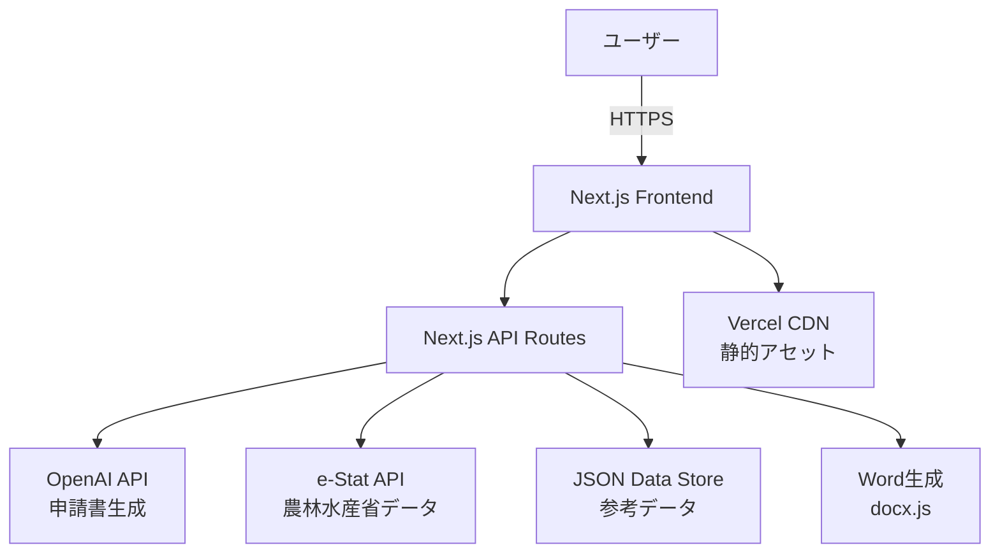

# システムアーキテクチャとポリシー

## 1. システムアーキテクチャ概要

### 1.1 アーキテクチャ図



### 1.2 技術スタック詳細

#### フロントエンド
- **Framework**: Next.js 15 (App Router)
- **Language**: TypeScript 5
- **Styling**: Tailwind CSS 4.1.9
- **UI Components**: Radix UI + shadcn/ui
- **State Management**: React useState/useReducer（軽量な状態管理）
- **Form Handling**: React Hook Form + Zod
- **Charts**: Recharts
- **Icons**: Lucide React

#### バックエンド・API
- **Runtime**: Next.js API Routes
- **External APIs**:
  - OpenAI API (GPT-4) - AI申請書生成
  - e-Stat API - 農林水産省統計データ
- **File Generation**: docx.js（Word文書生成）

#### インフラストラクチャ
- **Hosting**: Vercel
- **CDN**: Vercel Edge Network
- **Analytics**: Vercel Analytics
- **Deployment**: Git-based CI/CD

### 1.3 データフロー

#### 既存農家向けフロー
1. **入力**: 品目・地域・面積・売上・単価（5項目）
2. **処理**: e-Stat APIからの参考データ取得 + 推定ロジック
3. **出力**: 年間収支予測・月別見込み・ベンチマーク比較

#### 新規就農者向けフロー
1. **入力**: 地域・作物・面積（3項目）
2. **処理**: 統計データベースクエリ + 推定アルゴリズム
3. **AI生成**: OpenAI APIによる申請書生成
4. **出力**: 編集可能なWord文書

## 2. 開発ポリシー

### 2.1 コーディングガイドライン

#### TypeScript設計原則
```typescript
// ✅ 良い例：型安全性を重視
interface CropData {
  region: string
  crop: string
  yield: number // kg per are
  price: number // yen per kg
  confidence: number // 0-100
}

// ✅ 関数型プログラミングを優先
const calculateBudget = (data: CropData, area: number): BudgetEstimate => {
  return {
    annualRevenue: area * data.yield * data.price,
    confidence: data.confidence
  }
}

// ❌ 避ける：any型、クラスベース設計
```

#### コンポーネント設計パターン
```typescript
// ✅ 推奨：名前付きエクスポート、型定義、分離された責務
interface MetricCardProps {
  title: string
  value: string
  change: string
  changeType: "positive" | "negative" | "neutral"
}

export const MetricCard = ({ title, value, change, changeType }: MetricCardProps) => {
  return (
    <Card className="bg-white/90 backdrop-blur-sm rounded-3xl shadow-lg">
      {/* コンポーネント実装 */}
    </Card>
  )
}
```

#### ディレクトリ構造規約
```
- ディレクトリ名：ダッシュ付き小文字（existing-farmer, new-farmer）
- ファイル名：kebab-case（crop-data.ts, daily-record-modal.tsx）
- コンポーネント名：PascalCase（MetricCard, DailyRecordModal）
```

### 2.2 UI/UXデザインポリシー

#### デザインシステム
```css
/* カラーパレット */
:root {
  --sprout-green: #2E7D32;    /* メイン・Primary */
  --sky-blue: #42A5F5;        /* セカンダリ */
  --harvest-yellow: #F6C445;  /* アクセント */
  --soil-brown: #8D6E63;      /* サポート */
  --fog-grey: #F5F7F9;        /* 背景 */
  --charcoal: #263238;        /* テキスト */
}

/* タイポグラフィ */
.font-sans { font-family: Inter, 'Noto Sans JP', sans-serif; }
.tabular-nums { font-feature-settings: 'tnum'; } /* 数値表示 */
```

#### レスポンシブデザイン原則
- **モバイルファースト**: 最小画面サイズから設計
- **ブレークポイント**: sm:640px, md:768px, lg:1024px, xl:1280px
- **タッチフレンドリー**: 44px以上のタップターゲット

#### アクセシビリティ要件
- **WCAG 2.1 AA準拠**: カラーコントラスト4.5:1以上
- **キーボードナビゲーション**: Tab順序の論理的配置
- **スクリーンリーダー対応**: セマンティックHTML、適切なaria-label

### 2.3 パフォーマンスポリシー

#### パフォーマンス目標
- **3項目入力→予算感表示**: 3秒以内（P95）
- **AI申請書生成**: 10秒以内
- **Word出力生成**: 5秒以内
- **初期ページ読み込み**: 2秒以内（LCP）

#### 最適化戦略
```typescript
// ✅ コンポーネント最適化
const ExpensiveComponent = React.memo(({ data }: Props) => {
  const memoizedValue = useMemo(() => 
    expensiveCalculation(data), [data]
  )
  return <div>{memoizedValue}</div>
})

// ✅ 動的インポート
const HeavyChart = dynamic(() => import('@/components/heavy-chart'), {
  loading: () => <ChartSkeleton />
})
```

### 2.4 セキュリティポリシー

#### API セキュリティ
```typescript
// ✅ API キーの適切な管理
const openAIKey = process.env.OPENAI_API_KEY
if (!openAIKey) {
  throw new Error('OpenAI API key not configured')
}

// ✅ 入力検証
const validateCropData = (data: unknown): CropData => {
  return cropDataSchema.parse(data) // Zod validation
}
```

#### データ保護
- **個人情報**: 最小限の収集、暗号化保存
- **API通信**: HTTPS必須、適切なCORS設定
- **エラーハンドリング**: 機密情報の露出防止

### 2.5 品質保証ポリシー

#### コード品質
```json
// ESLint設定例
{
  "extends": [
    "next/core-web-vitals",
    "@typescript-eslint/recommended",
    "prettier"
  ],
  "rules": {
    "@typescript-eslint/no-unused-vars": "error",
    "@typescript-eslint/explicit-function-return-type": "warn",
    "prefer-const": "error"
  }
}
```

#### テスト戦略
- **Unit Tests**: 重要な計算ロジック（推定アルゴリズム等）
- **Integration Tests**: API エンドポイント
- **E2E Tests**: 主要ユーザーフロー（申請書生成等）

## 3. データ設計ポリシー

### 3.1 データ品質管理

#### バリデーション階層
```typescript
// API入力バリデーション
const CropDataInput = z.object({
  region: z.string().min(1),
  crop: z.string().min(1),
  area: z.number().positive()
})

// ビジネスロジック検証
const validateBusinessRules = (data: CropData): ValidationResult => {
  if (data.confidence < 50) {
    return { valid: false, reason: "信頼度が低すぎます" }
  }
  return { valid: true }
}
```

#### データソース優先順位
1. **e-Stat API**（政府統計データ）- 最高信頼度
2. **地域農業データ**（補完データ）- 中程度信頼度
3. **推定値**（フォールバック）- 低信頼度、明示的表示

### 3.2 外部API連携ポリシー

#### エラーハンドリング戦略
```typescript
const getDataWithFallback = async (region: string, crop: string) => {
  try {
    // 1. メインAPI試行
    return await eStatService.getCropData(region, crop)
  } catch (error) {
    console.error('e-Stat API error:', error)
    // 2. フォールバック処理
    return getMockCropData(region, crop)
  }
}
```

#### レート制限対応
- **キャッシュ戦略**: 頻繁に使用されるデータの一時保存
- **リクエスト制限**: 同一ユーザーからの連続API呼び出し制限
- **グレースフルデグラデーション**: API障害時の代替処理

## 4. 運用・保守ポリシー

### 4.1 デプロイメント戦略

#### Git ワークフロー
```
main branch: 本番環境
├── develop: 開発環境
├── feature/*: 機能開発ブランチ
└── hotfix/*: 緊急修正ブランチ
```

#### 自動デプロイメント
- **Vercel連携**: mainブランチへのpush時自動デプロイ
- **プレビューデプロイ**: Pull Request作成時
- **ロールバック**: 前バージョンへの即座復旧

### 4.2 監視・ログ戦略

#### パフォーマンス監視
- **Vercel Analytics**: Core Web Vitals監視
- **API レスポンス時間**: 閾値アラート設定
- **エラー率**: 異常検知とアラート

#### ログ管理
```typescript
// 構造化ログ出力
const logger = {
  info: (message: string, meta?: object) => {
    console.log(JSON.stringify({ 
      level: 'info', 
      message, 
      timestamp: new Date().toISOString(),
      ...meta 
    }))
  }
}
```

### 4.3 スケーラビリティ対応

#### 段階的拡張計画
- **Phase 1**: MVP機能（現在）
- **Phase 2**: データベース導入（PostgreSQL）
- **Phase 3**: マイクロサービス化検討
- **Phase 4**: CDN最適化、グローバル展開

#### パフォーマンス最適化
- **画像最適化**: Next.js Image Optimization
- **バンドル最適化**: Tree shaking、Code splitting
- **キャッシュ戦略**: ISR（Incremental Static Regeneration）活用

## 5. 継続的改善ポリシー

### 5.1 ユーザーフィードバック収集
- **使用状況分析**: Vercel Analytics活用
- **ユーザビリティテスト**: 定期的な実施
- **フィードバックループ**: 機能改善への迅速な反映

### 5.2 技術的負債管理
- **定期的なリファクタリング**: 技術スタック更新
- **依存関係管理**: セキュリティアップデート
- **コード品質維持**: 継続的なコードレビュー

---

このアーキテクチャとポリシーに従うことで、スケーラブルで保守性の高いアプリケーションの継続的な開発・運用を実現します。
