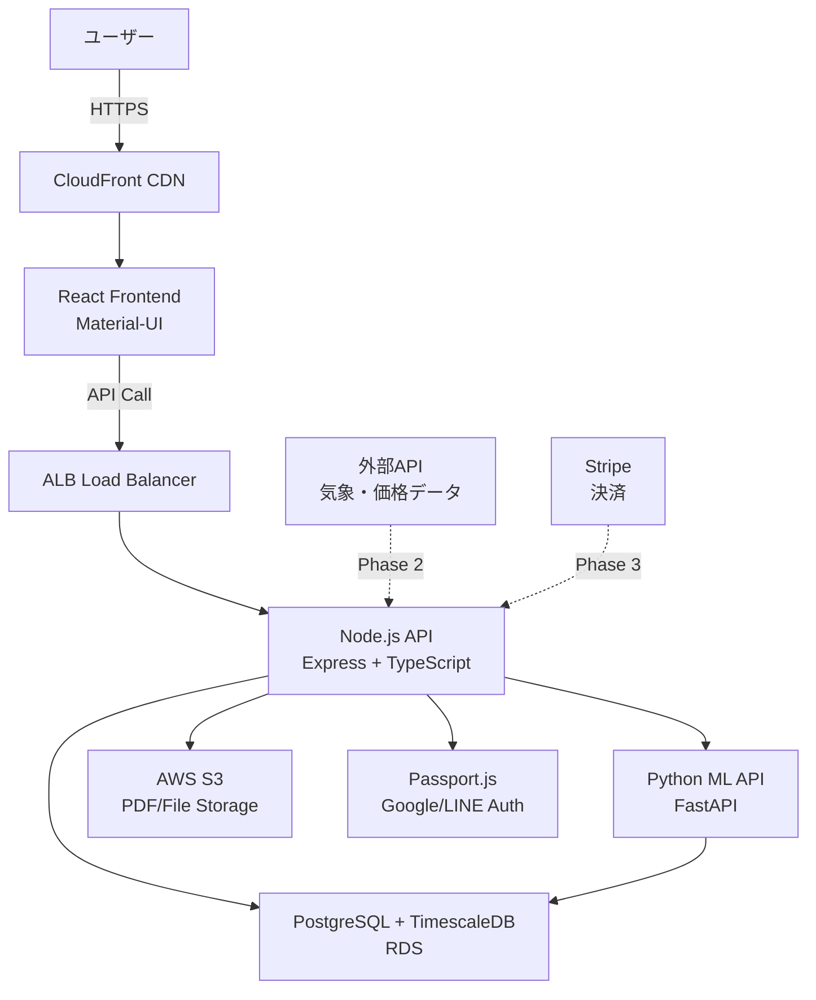

# 要件定義書

## 1. プロジェクト概要

### 1.1 プロジェクト名

- **「農業収支管理AIダッシュボード開発プロジェクト」**

### 1.2 背景・目的

- **背景**: 
  - 既存農家は収支予測が困難で、記録管理ツールはあっても「記録止まり」で意思決定につながらない
  - 新規就農者は計画作成・申請準備が煩雑で時間がかかり、就農への障壁となっている
  - 農業DXの推進により、データドリブンな農業経営への転換が求められている
  - 地域・同規模でのベンチマーク情報が不足し、改善余地が見えにくい
  - 農業申請書類の作成が複雑で、新規就農の大きな障壁となっている

- **目的**: 
  - 既存農家：収支管理・データ蓄積によるAI経営アドバイス、収益最適化支援
  - 新規就農者：3項目入力での瞬間予算感表示、農業経営改善計画認定申請書の自動生成
  - データネットワーク効果：既存農家のデータを活用した新規就農者向け高精度予測 yy
  - 社会全体：農業生産性向上、新規就農者増加、地域農業の持続可能性向上

### 1.3 システムのビジョン / スコープ

- **ビジョン**: 
  - 農業における「最小入力で最大価値」を実現し、データネットワーク効果により使用者が増えるほど予測精度が向上するプラットフォーム
  - 従来の「記録管理」から「予測・意思決定支援」への転換を実現
  - 既存農家と新規就農者の相互強化により、農業界全体のDXを推進

- **スコープ**: 
  - **含まれる範囲**: WebアプリケーションとしてのMVP実装、3項目入力での瞬間予算感表示、AI申請書自動生成
  - **MVP Phase**: 新規就農者向け申請書生成機能、外部データ（e-Stat）活用の推定ロジック
  - **Phase 2**: 既存農家向け収支管理・データ蓄積機能、AI経営アドバイス
  - **含まれない範囲**: ネイティブモバイルアプリ、IoTハードウェア連携、海外展開
  - **将来拡張予定**: 全国展開、多品目対応、価格最適化AI、農業IoT連携

---

## 2. ビジネス要件

### 2.1 ビジネスモデル情報

- **リーンキャンバス要約**:
  - **解決する課題**: 収支予測困難、入力継続の困難、ベンチマーク不足、就農計画作成の煩雑さ
  - **価値提案**: 3分入力→高精度収支予測、就農計画書自動生成、地域ベンチマーク提供
  - **収益構造**: 新規就農者向け買い切り+月額、既存農家向け月額SaaS課金
  - **顧客セグメント**: 既存農家（個人・法人）、新規就農者

- **競争優位性（データネットワーク効果）**:
  - 使用者増加による予測精度向上
  - 「新規×既存」の相互強化モデル
  - AIファースト設計による継続的学習・自動化

- **市場規模 / 成長予測**:
  - 初期ターゲット：既存農家1,000人、新規就農者100人/年
  - 1年後：既存農家5,000人、新規就農者500人/年
  - 3年後：既存農家20,000人、新規就農者1,000人/年（仮定）

### 2.2 成果指標（KPI/KGI）

- **KGI（重要目標達成指標）**:
  - MAU（月間アクティブユーザー）：3ヶ月後1,000人、1年後5,000人
  - MRR（月次経常収益）：1年後500万円達成
  - 新規就農計画書生成数：月間50件（6ヶ月後）

- **KPI（重要業績評価指標）**:
  - 必須5項目入力完了率：90%以上
  - 初回レポート閲覧率：85%以上
  - 月次ダッシュボード継続閲覧率：70%以上
  - 有料転換率：15%以上
  - NPS（Net Promoter Score）：50以上

### 2.3 ビジネス上の制約

- **予算・開発期間・リソース面**:
  - MVP開発期間：10週間
  - 小規模開発チーム想定（要確認）
  - β期間中は無料提供でデータ蓄積が前提

- **法的要件・規制**:
  - 個人情報保護法、GDPR準拠
  - 農業データの取り扱いに関する法的制約（要確認）
  - 青年等就農計画書の公的認定要件への対応（要確認）

---

## 3. ユーザー要件

### 3.1 ユーザープロファイル / ペルソナ

**ペルソナ1：既存農家（田中さん、55歳、ぶどう農家）**
- 栽培面積：2ha、家族経営、年収600万円
- デジタルツール：スマートフォン基本操作可能、PC使用は限定的
- 課題：毎年の収支見通しが立てづらい、記録は苦手、銀行融資時の説明資料作成が大変
- 利用シーン：夕方の作業終了後、月1-2回の頻度で収支状況を確認

**ペルソナ2：新規就農者（佐藤さん、28歳、脱サラ就農希望）**
- 背景：IT企業勤務、年収500万円、農業未経験
- デジタルツール：高いリテラシー、効率的なツール活用を重視
- 課題：就農計画書作成の複雑さ、現実的な収支計画が分からない
- 利用シーン：平日夜間・週末、就農準備期間中の情報収集・計画作成

### 3.2 ユーザーストーリー

1. **「既存農家として、3分の簡単入力で来年の収支見通しを把握したい。なぜなら作付け計画や設備投資の判断をスムーズに行いたいからだ。」**

2. **「既存農家として、どの品目が一番稼げるかを素早く知りたい。なぜなら限られた面積で収益を最大化したいからだ。」**

3. **「新規就農者として、希望条件を入力するだけで現実的な就農計画を作成したい。なぜなら申請書類の準備時間を短縮し、より確実な就農を実現したいからだ。」**

4. **「農家として、同地域・同規模の農家と比較して自分の経営状況を把握したい。なぜなら改善すべきポイントを見つけて収益向上を図りたいからだ。」**

5. **「農家として、金融機関に提出する資料を簡単に作成したい。なぜなら融資申請や補助金申請をスムーズに進めたいからだ。」**

### 3.3 MVP（Minimum Viable Product）の定義

- **MVP で実装する範囲**（1週間目標）:
  - **コア機能**: 新規就農者向けに特化
  - **3項目入力**: 地域・作物・面積のみで瞬間予算感表示
  - **AI申請書生成**: 農業経営改善計画認定申請書の全文自動生成
  - **Word出力**: 編集可能な形式でダウンロード
  - **外部データ連携**: e-Stat APIとの基本的な連携

- **MVP のゴール**:
  - 1週間で動作するプロトタイプを作成
  - 3項目入力から申請書生成までの一連のフロー検証
  - 新規就農者の初期ユーザビリティ検証
  - 推定ロジックの精度検証と改善点の洗い出し

- **Phase 2以降の拡張計画**:
  - 既存農家向け収支管理機能
  - AI経営アドバイス・価格最適化機能
  - データネットワーク効果の実現

---

## 4. 機能要件

### 4.1 機能一覧 / MoSCoW 分類

| 機能 ID | 機能名 | 要約 | Must/Should/Could/Won't | MVP 対象 |
|---------|-------|------|------------------------|----------|
| F-001 | ユーザー認証機能 | メール/パスワード、Google/LINE認証 | Must | Yes |
| F-002 | 農家プロフィール設定 | 地域・基本情報の登録 | Must | Yes |
| F-003 | 必須5項目入力機能 | 品目・地域・面積・売上・単価入力 | Must | Yes |
| F-004 | 収支予測AI機能 | 年間収支予測・月別見込み計算 | Must | Yes |
| F-005 | 品目別収益性分析 | 稼ぎ頭品目のランキング表示 | Must | Yes |
| F-006 | レポート表示機能 | ダッシュボード形式での結果表示 | Must | Yes |
| F-007 | 詳細入力機能（任意） | 収穫量・コスト内訳・作業スケジュール | Should | Yes |
| F-008 | 新規就農計画生成 | 希望条件から5年収支計画生成 | Must | Yes |
| F-009 | 計画書PDF出力 | 青年等就農計画書の自動生成 | Must | Yes |
| F-010 | 参考単価サジェスト | 地域×品目の相場情報表示 | Should | Yes |
| F-011 | データ出力機能 | CSV/PDF形式でのレポート出力 | Should | No |
| F-012 | ベンチマーク比較 | 地域・同規模との匿名比較 | Could | No |
| F-013 | シナリオ比較機能 | 単価・収量変動時の影響分析 | Could | No |
| F-014 | 通知・アラート機能 | 価格変動・作業時期の通知 | Won't | No |

### 4.2 機能詳細仕様

#### 4.2.1 `F-001: ユーザー認証機能`

- **概要**: ユーザーがメール/パスワード、または外部サービス連携でログインする
- **ユースケース**: 「新規ユーザーが初回サービス利用時」「既存ユーザーの再ログイン時」
- **前提条件**: 認証サービス（Auth0またはPassport.js）が導入されている
- **正常系フロー**:
  1. ユーザーがログイン画面を開く
  2. 認証方法を選択（メール/PW、Google、LINE）
  3. 認証情報入力・外部サービス認証
  4. 認証成功→ダッシュボード画面へ遷移
- **例外系フロー**:
  - 認証情報不正時：エラーメッセージ表示
  - 外部サービス連携失敗時：代替認証方法の案内
- **UI 要件**:
  - レスポンシブデザイン対応
  - 「やさしいデータ」コンセプトに沿った温かみのあるデザイン
- **非機能面注意**:
  - TLS 1.3以上での暗号化通信
  - セッション管理・CSRF対策

#### 4.2.2 `F-003: 必須5項目入力機能`

- **概要**: 農家が品目・地域・面積・売上・単価の5項目を3分以内で入力完了
- **ユースケース**: 「初回利用時の基本情報登録」「年度更新時のデータ入力」
- **前提条件**: ユーザー認証済み、農家プロフィール設定済み
- **正常系フロー**:
  1. 入力フォーム画面表示（進捗バー付き）
  2. 品目選択（ドロップダウン+自由入力）
  3. 地域設定（都道府県・市町村選択）
  4. 栽培面積入力（単位変換対応：㎡/a/ha）
  5. 年間売上合計入力
  6. 平均単価入力（参考単価サジェスト表示）
  7. バリデーションチェック
  8. 入力完了→予測計算実行
- **例外系フロー**:
  - 必須項目未入力：該当項目のハイライトとエラーメッセージ
  - 数値範囲外：現実的な範囲での再入力促進
  - 参考単価との大幅乖離：確認ダイアログ表示
- **UI 要件**:
  - 1画面内での完結、スクロール最小限
  - リアルタイム入力バリデーション
  - 参考値・単位チップでの入力支援
- **非機能面注意**:
  - 入力から予測表示まで3秒以内
  - 入力途中でのデータ保存（一時保存）

#### 4.2.3 `F-004: 収支予測AI機能`

- **概要**: 入力された5項目から年間収支予測と月別見込みを自動計算
- **ユースケース**: 「必須項目入力完了後の自動実行」「データ更新時の再計算」
- **前提条件**: 予測アルゴリズムv0実装済み、参考データベース構築済み
- **正常系フロー**:
  1. 入力データの受け取り
  2. 地域×品目の参考データ取得
  3. 月別分布テンプレート適用
  4. 収支予測計算実行
  5. 前年同月比計算（データがある場合）
  6. 信頼区間付きでの結果出力
- **例外系フロー**:
  - 参考データ不足：全国平均または類似品目データで補完
  - 計算エラー：エラーログ記録、ユーザーには「再計算中」表示
- **UI 要件**:
  - グラフによる視覚的表示（Chart.js使用）
  - 予測精度の信頼度表示
  - 前年比較（データがある場合）
- **非機能面注意**:
  - 計算処理3秒以内完了
  - 予測精度の継続的改善機能

#### 4.2.4 `F-008: 新規就農計画生成`

- **概要**: 希望条件から5年収支計画と設備投資計画を自動生成
- **ユースケース**: 「新規就農者の初回計画作成」「条件変更時の再計算」
- **前提条件**: 就農支援データベース、設備コストマスタ準備済み
- **正常系フロー**:
  1. 希望条件入力（品目・地域・面積・予算・目標年収・経験レベル）
  2. 地域・品目の実績データ取得
  3. 5年収支シミュレーション実行
  4. 必要設備リスト・初期投資額計算
  5. リスク要因の自動抽出
  6. 計画書データ生成
- **例外系フロー**:
  - 予算と目標のミスマッチ：現実的な範囲での調整提案
  - 地域データ不足：近隣地域データでの代替計算
- **UI 要件**:
  - ステップ形式での入力ガイド
  - リアルタイムでの概算表示
  - 調整可能なパラメータスライダー
- **非機能面注意**:
  - 計画生成10秒以内完了
  - 複数シナリオの比較表示

#### 4.2.5 `F-009: 計画書PDF出力`

- **概要**: 青年等就農計画書のPDF形式自動生成・ダウンロード
- **ユースケース**: 「就農計画完成後の申請書類作成」「印刷・提出用資料生成」
- **前提条件**: PDF生成ライブラリ（Puppeteer）実装済み、申請書テンプレート準備済み
- **正常系フロー**:
  1. 計画データの整形・レイアウト適用
  2. PDF生成実行（ヘッドレスChrome）
  3. ファイル生成完了確認
  4. ダウンロードリンク提供
  5. 生成履歴の保存
- **例外系フロー**:
  - PDF生成失敗：再試行機能、エラー通知
  - ファイルサイズ過大：画像圧縮、レイアウト調整
- **UI 要件**:
  - 生成進行状況の表示
  - プレビュー機能
  - 署名欄・印鑑欄の確保
- **非機能面注意**:
  - PDF生成10秒以内完了
  - ファイルサイズ5MB以内
  - A4印刷レイアウト最適化

---

## 5. 非機能要件

### 5.1 パフォーマンス要件

- **レスポンス時間**: 主要画面3秒以内（P95）、PDF生成10秒以内
- **同時接続数**: 初期1,000ユーザー、将来的に10,000ユーザー対応
- **処理量**: 必須5項目入力から予測表示まで3秒以内、年間100万レコード処理対応
- **データ転送**: 画像最適化、CSS/JS圧縮によるページ読み込み高速化

### 5.2 セキュリティ要件

- **認証／認可**: Passport.js多要素認証、JWT トークン管理、セッション管理
- **データ保護**: TLS 1.3以上通信、保存時AES-256暗号化、個人情報の匿名化処理
- **監査ログ**: ユーザー操作ログ、システムアクセスログの記録・保管
- **コンプライアンス**: 個人情報保護法、GDPR準拠、農業データの適切な取り扱い

### 5.3 可用性・信頼性

- **稼働率**: 99.5%以上（月間ダウンタイム3.6時間以内）
- **障害時の復旧手順**: 自動バックアップ（日次）、データベース冗長化
- **フェイルオーバー**: AWS Multi-AZ対応、負荷分散による可用性確保
- **データ保護**: 定期バックアップ（日次）、保存期間3年、ポイントインタイム復旧

### 5.4 ユーザビリティ / UI・UX

- **アクセシビリティ**: WCAG 2.1 AA準拠、キーボードナビゲーション対応
- **多言語対応**: 主に日本語、将来的に英語対応検討
- **操作導線**: 必須入力3分以内完了、直感的なナビゲーション
- **デザイン**: 「やさしいデータ」「楽しく計画」コンセプトに基づくUI設計
- **レスポンシブデザイン**: PC/タブレット/スマートフォン対応

### 5.5 スケーラビリティ

- **水平/垂直スケーリング**: AWS ECS Fargate オートスケール、RDS スケールアップ対応
- **突発的アクセス増対策**: CloudFront CDN、Redis キャッシュ、適切なロードバランシング
- **データベース**: PostgreSQL + TimescaleDB、インデックス最適化
- **ユーザー数拡張**: 初期1,000人→1年後5,000人→3年後20,000人対応

---

## 6. データ設計・管理要件

### 6.1 ユーザーの実現したい価値とデータ戦略

#### 売上予測の高精度化
- **目標精度**: ±20%程度の誤差範囲
- **予測期間**: 年間予測 + 月別詳細予測
- **更新頻度**: 月次更新、重要イベント時の随時更新

#### AIアドバイス機能
- **価格最適化**: 最適販売価格の提案（チャンネル別）
- **販売チャンネル推奨**: 収益最大化のためのチャンネル選択
- **収穫時期最適化**: 品質・価格・労働力を考慮した最適収穫タイミング

### 6.2 データ分類とインプット戦略

#### レベル1: 必須項目（3分入力目標）
```json
{
  "basic_info": {
    "crop_type": "string",           // 品目（例：ぶどう）
    "variety": "string",             // 品種（例：シャインマスカット）
    "cultivation_area": "number",    // 栽培面積（単位：a）
    "location": {
      "prefecture": "string",        // 都道府県
      "city": "string"              // 市町村
    }
  },
  "sales_history": {
    "annual_revenue": "number",      // 年間売上（円）
    "average_price": "number",       // 平均単価（円/kg）
    "main_channel": "string"         // 主要販売チャンネル
  }
}
```

#### レベル2: 詳細項目（任意、精度向上）
```json
{
  "production_details": {
    "harvest_history": [
      {
        "year": "number",
        "total_yield": "number",     // 総収穫量（kg）
        "quality_distribution": {    // 品質等級別比率
          "premium": "number",       // 特秀品（%）
          "excellent": "number",     // 秀品（%）
          "good": "number"          // 優品（%）
        }
      }
    ],
    "work_efficiency": {
      "labor_hours_per_area": "number",  // 単位面積当たり作業時間
      "technology_level": "string",      // 技術レベル（初級/中級/上級）
      "equipment_status": "string"       // 設備状況
    }
  },
  "cost_structure": {
    "material_cost": "number",       // 資材費（年間）
    "utility_cost": "number",        // 光熱費（年間）
    "labor_cost": "number",          // 人件費（年間）
    "equipment_depreciation": "number" // 設備減価償却費
  },
  "sales_details": {
    "monthly_sales": [               // 月別販売実績
      {
        "month": "number",
        "volume": "number",          // 販売量（kg）
        "average_price": "number",   // 平均価格（円/kg）
        "channels": [
          {
            "type": "string",        // チャンネル種別
            "volume_ratio": "number", // 販売量比率（%）
            "price": "number"        // 価格（円/kg）
          }
        ]
      }
    ]
  }
}
```

### 6.3 外部データソース

#### 気象・環境データ
- **気象庁API**: 日次気象データ（温度、降水量、日照時間、湿度）
- **災害リスク**: リアルタイム警報（台風、霜害、干ばつ、豪雨）
- **更新頻度**: 日次～リアルタイム

#### 市場・価格データ
- **農林水産省卸売市場データ**: 日別価格、取引量、等級別価格、産地別価格差
- **小売価格統計**: 週次更新（スーパー、直売、オンライン価格）
- **供給予測**: 月次更新（全国・地域別生産量、収穫予測、作付面積）

#### 消費・需要データ
- **家計調査**: 月次消費量、購入頻度、季節パターン、価格感応度
- **イベントカレンダー**: 祝日、季節イベント、贈答時期、収穫祭等

### 6.4 データ処理・統合フロー

#### データ収集フロー
1. **ユーザー入力**: 段階的入力（レベル1→レベル2→レベル3）
2. **外部データ**: 自動取得（API連携、バッチ処理）
3. **データ検証**: バリデーション、異常値検出、欠損値補完

#### データ統合・前処理
```python
# データ統合例
def integrate_prediction_data(user_data, external_data):
    features = {
        # 基本特徴量
        'area_yield_ratio': calculate_yield_per_area(user_data),
        'price_volatility': calculate_price_volatility(external_data),
        'seasonal_index': calculate_seasonal_pattern(external_data),
        
        # 派生特徴量
        'weather_growth_score': calculate_weather_impact(external_data),
        'market_competition_index': calculate_competition(external_data),
        'quality_premium_ratio': calculate_quality_premium(user_data),
        
        # 時系列特徴量
        'price_trend': calculate_price_trend(external_data),
        'demand_forecast': calculate_demand_forecast(external_data),
        'supply_pressure': calculate_supply_pressure(external_data)
    }
    return features
```

### 6.5 AIエンジンのデータ要件

#### 売上予測エンジン
- **生産量予測**: 気象データ + 栽培面積 + 技術レベル + 過去実績
- **価格予測**: 市場データ + 需給バランス + 季節要因 + 品質等級
- **需要予測**: 消費統計 + イベント要因 + 価格弾力性

#### 最適化エンジン
- **価格最適化**: 価格弾力性 + 競合価格 + 品質プレミアム + チャンネル特性
- **チャンネル推奨**: 手数料 + 配送コスト + 顧客属性 + 在庫回転率
- **収穫時期最適化**: 生育予測 + 価格予測 + 労働力 + 貯蔵コスト

### 6.6 データ品質管理

#### 入力データ品質保証
- **バリデーションルール**: 入力値範囲チェック、整合性チェック
- **異常値検出**: 統計的手法による外れ値検出・修正提案
- **ユーザー教育**: 正確な入力方法のガイダンス・参考値表示

#### 外部データ品質管理
- **データソース信頼性**: 公的機関・業界団体データ優先
- **更新頻度監視**: データ更新遅延検出・アラート
- **データ補完**: 欠損データの推定・補完ロジック

### 6.7 段階的データ拡張計画

#### Phase 1 (MVP): 基本予測データ
- **ユーザー入力**: レベル1（必須5項目）のみ
- **外部データ**: 静的参考データ（過去統計平均値）
- **予測精度**: ±30%

#### Phase 2: 精度向上データ
- **ユーザー入力**: レベル1 + レベル2
- **外部データ**: リアルタイムAPI連携（気象・価格）
- **予測精度**: ±20%

#### Phase 3: 高度分析データ
- **ユーザー入力**: 全レベル対応
- **外部データ**: 全データソース統合
- **予測精度**: ±15%

---

## 7. インテグレーション要件

### 7.1 外部サービス / SaaS 連携

- **認証系**: 
  - Passport.js（Google OAuth、LINE Login）
  - Auth0（将来のエンタープライズ向け拡張）
- **データベース系**: 
  - AWS RDS PostgreSQL（メインデータベース）
  - TimescaleDB（時系列データ処理）
- **決済系**: 
  - Stripe（サブスクリプション課金、将来実装）
- **ストレージ系**: 
  - AWS S3（PDF、画像ファイル保存）
  - CloudFront（CDN）
- **AI・ML 系**: 
  - 自社開発予測モデル（Python + FastAPI）
  - 将来拡張：外部AI API連携
- **外部データ**: 
  - 気象庁API（JMA API）- Phase 2で連携
  - 市場価格API - Phase 2で連携

### 7.2 API 仕様

- **提供 API**: RESTful API、OpenAPI 3.0仕様書
- **主要エンドポイント**:
  - `POST /api/auth/login` - ユーザー認証
  - `GET /api/users/{id}/profile` - ユーザープロフィール取得
  - `POST /api/farms/predictions` - 収支予測計算
  - `GET /api/farms/{id}/dashboard` - ダッシュボードデータ
  - `POST /api/plans/generate` - 就農計画生成
  - `GET /api/plans/{id}/pdf` - 計画書PDF生成
- **認証方式**: JWT Bearer Token
- **レスポンス形式**: JSON、エラーレスポンス統一フォーマット

### 7.3 データ連携要件

- **データ形式**: JSON（API）、CSV（インポート/エクスポート）
- **頻度**: リアルタイム（ユーザー操作）、バッチ（外部データ取得は将来実装）
- **再送制御**: 通信失敗時の指数バックオフリトライ、最大3回試行
- **データ同期**: ユーザーデータのリアルタイム更新、予測結果のキャッシュ

---

## 8. 技術選定とアーキテクチャ

### 8.1 技術スタックの要約

- **フロントエンド**: React 18 + TypeScript, Material-UI v5, Chart.js
- **バックエンド**: Node.js + Express + TypeScript, Passport.js
- **データベース**: PostgreSQL 14+ + TimescaleDB, Prisma ORM
- **AI・機械学習**: Python + FastAPI, scikit-learn, pandas
- **インフラ**: AWS (ECS Fargate, RDS, S3, CloudFront)
- **開発・運用**: Docker, GitHub Actions, Jest + Testing Library

### 8.2 アーキテクチャ概要

- **UI 層**: React SPA（フロントエンド）
- **API 層**: Node.js + Express（RESTful API）
- **AI/ML 層**: Python + FastAPI（予測エンジン）
- **DB 層**: PostgreSQL + TimescaleDB（データ永続化）
- **外部連携**: 認証SaaS、気象・価格API（将来）
- **インフラ層**: AWS クラウドサービス

### 8.3 システム構成図



---

## 9. 開発プロセス / スケジュール

### 9.1 開発モデル・プロセス

- **アジャイル / イテレーティブ**: MVP → ユーザーフィードバック → 段階的機能拡張
- **リリース戦略**: β版（無料）→ フィードバック反映 → 本格リリース（有料化）
- **品質管理**: 継続的インテグレーション、自動テスト、コードレビュー

### 9.2 スケジュール

| フェーズ | 期間 | 主なタスク |
|----------|------|------------|
| Phase 1: MVP開発 | Week 1-10 | 要件確定、基盤設計、コア機能実装、パイロット実証 |
| └ Week 1-2 | 基盤設計 | DB設計、API設計、UI/UXワイヤーフレーム、開発環境構築 |
| └ Week 3-5 | コア機能開発 | 必須5項目入力、収支予測AI、ダッシュボード |
| └ Week 6-7 | 拡張機能開発 | 詳細入力、コスト分析、参考単価サジェスト |
| └ Week 8-9 | 就農者機能 | 計画生成、PDF出力、5年収支予測 |
| └ Week 10 | パイロット・FB | 岩手県実証、ユーザビリティテスト、改善反映 |
| Phase 2: 機能拡張 | Month 3-6 | 外部API連携、予測精度向上、PWA対応 |
| Phase 3: スケール | Month 6-12 | 全国展開、エンタープライズ機能、収益化 |

---

## 10. リスクと課題

### 10.1 リスク一覧

| No | リスク内容 | 影響度 | 発生確率 | 対応策 |
|----|------------|--------|----------|--------|
| R1 | AI予測精度の低下 | 高 | 中 | 段階的精度向上、信頼区間表示、ユーザー教育 |
| R2 | ユーザー獲得の困難 | 高 | 中 | 農協連携、展示会参加、丁寧なサポート体制 |
| R3 | 外部API依存リスク | 中 | 低 | 複数API活用、キャッシュ機能、フォールバック処理 |
| R4 | データ品質問題 | 中 | 中 | 入力バリデーション、データクレンジング、ユーザー教育 |
| R5 | スケーラビリティ問題 | 中 | 低 | クラウドネイティブ設計、負荷テスト、段階的拡張 |
| R6 | セキュリティ脆弱性 | 高 | 低 | TLS暗号化、定期脆弱性診断、セキュリティ監査 |
| R7 | 法的規制変更 | 中 | 低 | 専門家連携、法務チェック、適切な免責事項 |
| R8 | 開発チームのスキル不足 | 中 | 中 | 外部専門家活用、研修実施、段階的機能実装 |

### 10.2 課題 / 前提条件

- **技術的課題**:
  - 初期データ不足による予測精度の制約
  - 農業特有のデータの季節性・地域性への対応
  - スマートフォンでの使いやすさとPC版の機能性のバランス

- **ビジネス的課題**:
  - 農家のデジタル化への抵抗感克服
  - 無料β期間からの有料転換戦略
  - 地域農協との連携体制構築

- **運用的課題**:
  - サポート体制の段階的構築
  - データ品質維持のためのユーザー教育
  - 継続的な機能改善のためのフィードバック収集体制

---

## 11. ランニング費用と運用方針

### 11.1 ランニング費用の目安

**Phase 1（MVP期間）**:
- **AWS インフラ**: 月額 $200-500（ECS、RDS、S3、CloudFront）
- **外部サービス**: 月額 $50-100（認証、監視ツール）
- **ドメイン・SSL**: 年額 $50
- **合計**: 月額 $250-600

**Phase 2（拡張期間）**:
- **AWS インフラ**: 月額 $500-1,500（ユーザー増加に伴うスケール）
- **外部API**: 月額 $100-300（気象・価格データ）
- **外部サービス**: 月額 $100-200（決済、高度な監視）
- **合計**: 月額 $700-2,000

**Phase 3（本格運用）**:
- **AWS インフラ**: 月額 $1,500-5,000（全国展開規模）
- **外部API・サービス**: 月額 $500-1,000
- **サポート・保守**: 月額 $1,000-2,000（人件費含む）
- **合計**: 月額 $3,000-8,000

### 11.2 運用・保守体制

- **運用チーム**: 
  - Phase 1: 開発者兼任 2名
  - Phase 2: 専任運用担当 1名追加
  - Phase 3: 運用チーム 3-5名（24時間監視体制）

- **監視ツール**: 
  - AWS CloudWatch（基本監視）
  - AWS X-Ray（トレーシング）
  - Sentry（エラー監視）
  - 将来：Datadog（高度な監視・アラート）

- **アップデート方針**: 
  - セキュリティ更新：即座
  - 機能追加：月1回程度
  - 大規模アップデート：四半期ごと

- **サポート体制**:
  - Phase 1: メール・チャットサポート（営業時間内）
  - Phase 2: FAQ充実、チャットボット導入
  - Phase 3: 電話サポート、農業専門コンサルタント連携

---

## 12. 変更管理

- **要件変更の合意プロセス**:
  - 軽微な変更：開発チーム内での判断
  - 機能追加・変更：ステークホルダー承認必須
  - 大規模変更：ビジネス影響評価 + 正式承認フロー

- **変更管理ツール**:
  - GitHub Issues（要件・バグ管理）
  - GitHub Pull Request（コード変更履歴）
  - Notion（仕様書・議事録管理）

- **ドキュメント管理**:
  - 要件定義書：四半期ごと更新
  - API仕様書：自動生成（OpenAPI）
  - ユーザーマニュアル：機能追加時更新

---

## 13. 参考資料 / 関連ドキュメント

- **設計資料**:
  - `docs/input/デザイン.md` - UIデザインコンセプト・カラーパレット
  - `docs/input/バリュープロポジション.md` - 顧客価値・ソリューション設計
  - `docs/input/リーンキャンバス.md` - ビジネスモデル・競争優位性
  - `docs/input/要件定義所.md` - 技術仕様・データモデル詳細
  - `docs/output/data_design_specification.md` - データ設計・AIアルゴリズム詳細仕様

- **技術参考資料**:
  - [PostgreSQL 公式ドキュメント](https://www.postgresql.org/docs/)
  - [React 公式ドキュメント](https://react.dev/)
  - [Material-UI v5 ガイド](https://mui.com/)
  - [AWS ECS ベストプラクティス](https://docs.aws.amazon.com/ecs/)

- **業界・法的参考資料**:
  - 農林水産省「青年等就農計画制度について」
  - 個人情報保護委員会「個人情報保護法ガイドライン」
  - 農業DX関連調査レポート（要収集）

- **プロジェクト管理**:
  - GitHub Repository: `https://github.com/[org]/agriculture-dashboard`
  - Notion Workspace: プロジェクト進捗・議事録管理
  - Figma: UI/UXデザイン資料

---

> **補足**:
>
> - このプロジェクトは**アジャイル開発**を前提とし、MVP後のユーザーフィードバックにより要件の継続的改善を想定しています。
> - **AI/ML 予測精度**は段階的向上を前提とし、初期は「予測参考値」として提供し、データ蓄積により精度向上を図ります。
> - **スケーラビリティ**を重視したクラウドネイティブ設計により、ユーザー増加に対応可能な拡張性を確保しています。
